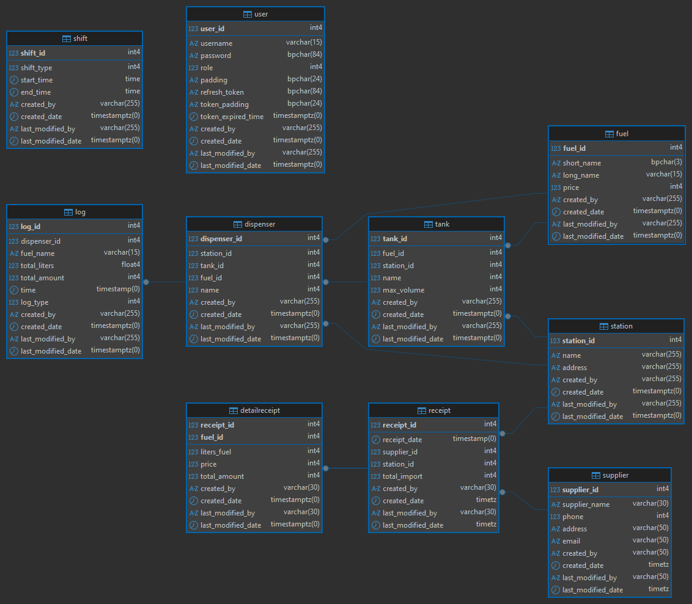

# Gas station management software (outdated, will be updated)
## Hardware (simulator)
(empty)
## Database
- Using PostgreSQL 17 for the database system.
### The ERD of the gas station management software

**Supposed that a user can managed all the gas stations, there's no need to establish any relation from the user table to other tables.**    
**_Update: The column password of the table user has been changed from **~~varying character(72)~~** to varying character(84) due to BCrypt(intended hash algorithm) is not fully supported in C#, ASP.NET built in PasswordHasher class will be used instead._**
- There are 2 database users: one for reading operations (SELECT) and one for writing operations (INSERT, DELETE, UPDATE).
- The database can be hosted on port 5432 with the credentials inside the env file (Database/database.env).
- The tables can be found on **petro_application** schema, in **Intern** database.
## Server
- Using .NET 9 to build a server with minimal APIs.
- The server can establish 2 connections to the database: one for the *read-only* connection and one for the *write-only* connection.
- Using JWT with asymmetric keys for authentication. (fixing)
## UI
- Will be using Angular for making the UI.
## Todos
- Start making the hardware simulator.
- Finish the database (if needed).
- Setup all server endpoints.
- ~~Build an UI~~ Finish the UI. (fixed the login UI) 
...
